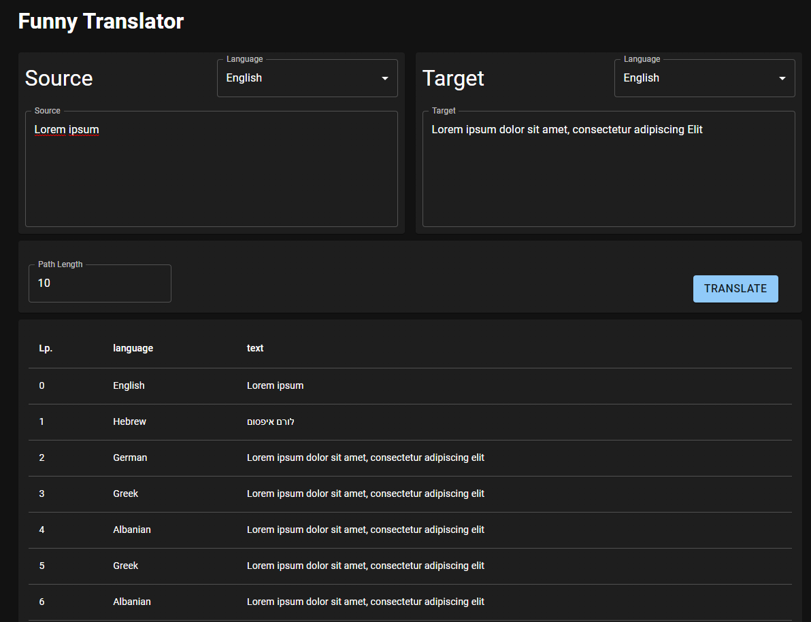
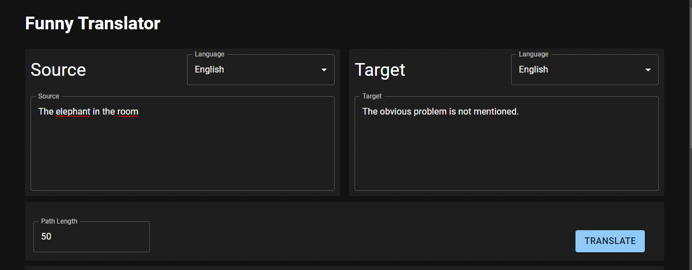
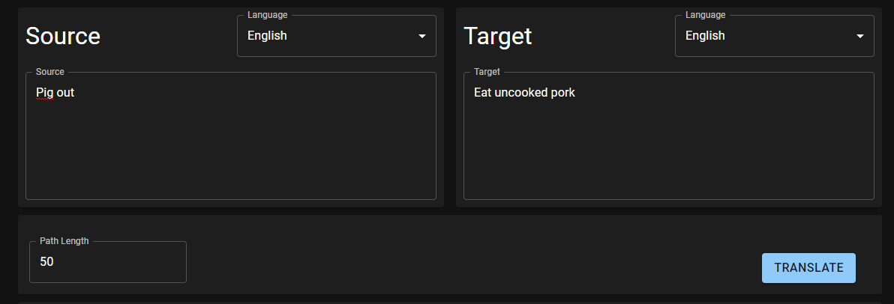
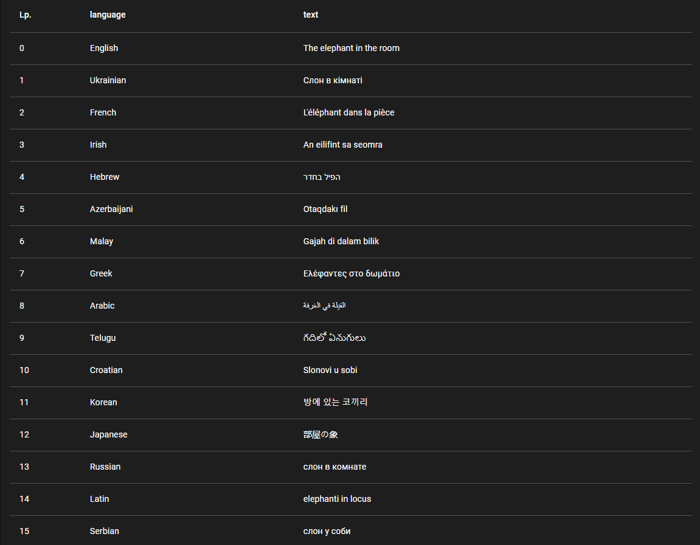

# Funny Translator

It is a simple translator website using translations through different languages.
Website use API Google Translate.

Translator is deploy [here](https://n2oneprogrammer.github.io/FunnyTranslator/)


## Author

- [@Dominik Wojtasik](https://github.com/n2oneProgrammer)


## Run Locally

Clone the project

```bash
  git clone https://github.com/n2oneProgrammer/FunnyTranslator.git
```

Go to the project directory

```bash
  cd FunnyTranslator
```

Install dependencies

```bash
  npm install
```

Start the server

```bash
  npm run start
```

## Screenshots







